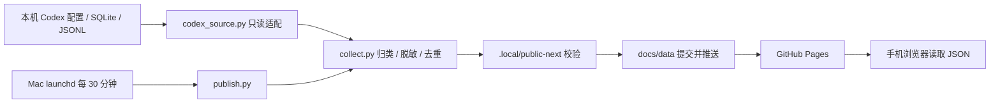

# Codex 定时任务监控页设计 spec

状态：已实现的 V1。本文描述当前代码，未来方案另列，不代表功能承诺。

## 1. 目标与范围

将本机 Codex 定时任务的执行结果汇总成适合手机浏览的公开只读看板，回答任务最近是否执行、报告了什么结果、哪些异常需要关注。兼容独立运行的普通任务和在原对话继续运行的任务；每次动态发现新增任务。

监控组件与业务任务分离：不触发任务、不修改任务配置、不写 Codex 数据库，不影响原任务执行。它也不独立复核外部业务系统，不能将“已归档”或“会话完成”视为业务成功。

## 2. 技术栈与部署

| 层 | 当前实现 | 职责 |
| --- | --- | --- |
| 本机调度 | macOS 用户级 launchd | 登录后加载，每 1800 秒尝试同步，RunAtLoad 首次执行 |
| 来源适配 | Python 3.9+ 标准库、sqlite3、JSON/JSONL、配置白名单解析 | 探测当前 Codex 文件和字段，数据库以 mode=ro / query_only 打开 |
| 采集与转换 | Python 标准库 | 日志解析、去重、结果归类、脱敏、滚动保留 |
| 本机状态 | `.local/` 文件 | 解析缓存、互斥锁、发布恢复日志、运行回执；不提交 Git |
| 持久化与传输 | Git、GitHub 仓库 | 保存公开 JSON 快照和历史提交，推送后检查远端一致 |
| 认证 | 当前部署使用 GitHub CLI 凭据助手、HTTPS remote | 复用已有登录，不在仓库或页面存令牌 |
| 页面 | 原生 HTML / CSS / JavaScript、Fetch API | 无前端框架、npm 构建或第三方运行时依赖 |
| 托管 | GitHub Pages，main 分支 `/docs` | 发布静态页面和 JSON |
| 域名 | Cloudflare 管理 DNS；`docs/CNAME` | `codex.wellwellsleep.com` 指向 `wellsleep.github.io` |

当前没有 Worker、D1、服务端查询 API、模型 API 或云端采集进程。Cloudflare 的 DNS/可选代理不参与数据持久化。GitHub Pages 的 HTTPS 由其域名设置管理；若启用 Cloudflare 代理，应使用与有效源站证书配套的严格 TLS 配置，不能把 DNS 检查成功等同于所有客户端可访问。

## 3. 数据流与模块

- `scripts/codex_source.py`：动态配置发现、数据库能力探测、运行与会话关联；不负责业务结果分类。
- `scripts/collect.py`：解析会话轮次，生成稳定运行 ID，归类和脱敏，决定是否发布快照。
- `scripts/publish.py`：锁、Git 门禁、暂存校验、可恢复提交、推送及远端一致性验证。
- `scripts/install_launchd.py`：安装当前用户的后台同步任务。
- `docs/index.html`、`app.js`、`style.css`：展示、筛选及同步新鲜度提示。

## 4. 来源发现与兼容

每次读取 `~/.codex/automations/*/automation.toml`，只解析明确允许的顶层标量字段。名称、状态和周期更新以及新任务将在后续采集反映；不维护固定任务 ID 清单。只监控当前仍有配置的任务，删除的任务不再展示。按任务创建时间隔离 ID 重用。

会话索引选择编号最高的 `state_*.sqlite`，不因格式变化退回旧库以免展示过时数据；运行元数据来自 `sqlite/codex-dev.db`。读取前检查表字段，允许无关字段增加。

运行发现合并三条证据路径：

1. `automation_runs` 的任务与会话关联。
2. 根会话首条用户消息中的 `Automation ID`，补充没有运行索引的情况。
3. 原对话目标会话的 `<heartbeat><automation_id>` 标记，识别每次定时触发的轮次。

普通独立任务按运行会话聚合，后续重试或跟进会更新该会话最新结果。原对话任务按明确标记的触发轮次分别记账，普通手工对话不混入。子代理不作为独立业务运行。稳定运行 ID 由任务 ID、会话 ID 和启动时间生成，与发现来源无关。

可选索引不可用时使用可用回退并发布覆盖警告；关键结构不兼容、配置读取失败、零任务配置或所有运行发现入口不可用时停止发布。原始日志暂时消失时保留已知历史并标记 `evidence_stale`。未知触发格式可能形成回执缺口，不能假定未来版本自动兼容。兼容修复应集中在适配层并补充真实结构对应的测试。

## 5. 时间与心跳设计

“发布心跳”和 Codex 的“原对话 heartbeat 任务”是两个概念：前者证明采集链路近期成功，后者是被监控任务的一种触发方式。

| 参数 | 当前值 | 含义及实现位置 |
| --- | --- | --- |
| 采集间隔 | 30 分钟 | launchd StartInterval=1800；清单 collection_interval_minutes=30 |
| 无变化发布心跳 | 120 分钟（2 小时） | collect.py；清单 heartbeat_minutes=120 |
| 同步过期阈值 | 超过 180 分钟（3 小时） | 清单 stale_after_minutes=180；页面据此计算 |
| 任务疑似逾期 | 下次运行时间已过 2 小时 | 独立于心跳；仅快照新鲜时提示 |
| 执行中推断窗口 | 6 小时 | 已开始但缺少完成回执；不是进程探活 |
| 历史保留窗口 | 90 天 | 按运行启动时间滚动筛选 |

发布决策：

- 对任务、运行、警告、来源能力计算内容哈希；有变化就在本轮采集发布，不等两小时。
- 内容不变时，距上次已发布快照的 `collected_at` 达到 7200 秒才发布心跳。
- 心跳/过期策略字段变化时，也发布新清单以让页面应用新策略。
- 无变化且未到心跳时间，更新本地采集回执，不产生远端数据提交。
- 成功发布任何快照都会重置下一次无变化心跳的计时起点，不按固定整点触发。

例如 10:00 已发布，10:30、11:00、11:30 无变化就不提交，12:00 采集成功才发布心跳；如果 10:30 发现新结果并发布，下一次无变化心跳最早为 12:30。正常持续在线且完全无变化时，约每天 12 次心跳提交；这是预期量而非保证。

三小时过期阈值为两小时心跳留出约一小时缓冲，覆盖调度、构建、网络及缓存延迟。页面使用清单中的间隔生成同步条、说明及过期警告，不在不同 UI 文案中复制阈值。时间显示为北京时间，存储时间为 UTC。

`collected_at` 是已公开快照的采集时间，不等于每次本地检查时间，更不等于业务任务执行时间。较新的采集时间也不代表所有结果已重新核实，必须同时看 warnings 和 evidence_stale。

Mac 休眠、退出登录或离线时无法正常采集；恢复并成功同步后补充可发现的记录，不保证重放每个错过的半小时。浏览器每分钟重新判断新鲜度，但不会定时下载数据；打开页面或点击“刷新数据”才重新请求。正常变化可见延迟为下次采集等待加上 GitHub 部署及缓存时间，无严格实时 SLA。

## 6. 公开数据契约

`docs/data/manifest.json` 为入口，当前 `schema_version=1`：

- 版本与范围：schema_version、timezone、retention_days、window_start、coverage_start。
- 新鲜度与策略：collected_at、content_hash、collection_interval_minutes、heartbeat_minutes、stale_after_minutes。
- 数据索引：tasks、run_count、shards（文件名及计数）。
- 证据边界：warnings、source_capabilities、classification_note。

任务包含 ID、名称、启停状态、触发类型、周期说明、上次/下次执行时间、最新运行引用、运行数、回执缺口和疑似逾期标记。周期为当前配置，不追溯历史配置。

运行按月写为 `runs-YYYY-MM-<内容哈希>.json`，包含稳定 ID、任务/会话 ID、启动/完成时间、outcome、confidence、basis、summary、detail、error、source、轮次数与时长，必要时附 evidence_stale。

月分片按内容寻址；清单原子替换，保留本轮及上一清单引用的分片以缓解缓存版本交错。浏览器并行加载清单指定分片，验证文件名、数量和版本，再整体切换数据；加载失败保留当前页面已有结果并提示。该机制降低混版风险，但不保证任意久远的缓存清单永远可读。

90 天保留仅约束当前公开快照；Git 历史仍可能保存旧内容，删除当前文件并不等于从 Git 历史彻底删除数据。

## 7. 状态和隐私边界

结果为 success、partial、failed、unknown、running；最终回复明确陈述优先，否则使用保守规则。confidence 区分 explicit、inferred、unknown，并展示 basis。缺少证据不能补成成功；ACCEPTED、ARCHIVED、PENDING_REVIEW 等查看状态不参与业务成功判断。

只公开精简摘要和必要元数据。原始数据库、提示词、工具输出和完整会话留在本机；解析缓存可能含原文，必须保留在 Git 忽略的 `.local/`。摘要清理链接、邮箱、IP、本地路径、常见凭据和长标识，摘要约 220 字符、详情约 1600 字符，再执行发布前扫描。规则脱敏不能保证任意自由文本绝对安全。

页面用 textContent 渲染结果。noindex 不是访问控制；GitHub 仓库和页面均按公开数据处理。原任务 codex:// 链接主要供有原任务的电脑使用。

## 8. 发布可靠性与运维

发布器以非阻塞文件锁防并发，要求 main 分支和干净工作区，先 fetch/fast-forward。发现远端代码更新后结束当前轮，下一轮运行新代码。拒绝分叉和未推送的非数据提交，不自动强推或覆盖用户修改。

在 `.local/public-next` 生成并验证完整数据：任务/运行唯一性、引用完整性、分片数量、总数、状态枚举和敏感模式扫描。通过后仅提交 docs/data。prepared.json 记录基准提交和文件哈希，只有现场与计划一致才恢复中断提交；推送失败仅自动重试符合发布器格式的数据提交。最终再次 fetch 验证 HEAD 与远端一致，写入 publish-status.json。

失败保留最后有效公开快照，不伪造成功心跳。页面只能通过旧快照变陈旧提示同步故障，不能实时读取本机错误；诊断要查看本机发布回执和 launchd 日志。需要区分采集成功、推送成功、Pages 部署成功和客户端访问成功。

安装器只继承不含账号密码的本机回环代理环境，避免后台任务缺少终端代理；本机代理停止也可能造成发布失败。DNS 负缓存、运营商解析路径及浏览器安全 DNS 会影响访问，DNS 检查成功不能证明客户端解析正确。

安装、暂停、手动发布和状态查看命令见 [README](README.md)。修改代码时后台发布器会因工作区不干净跳过，完成精确提交推送后再执行一次发布器确认恢复。

## 9. 验收与后续演进

变更需运行 unittest、发布数据校验和 git diff --check；心跳边界验证 30 分钟、1 小时、7199 秒不发布，7200 秒发布。来源测试覆盖动态新增任务、ID 重用、字段变化、缺失来源、普通对话隔离、去重和源文件只读。页面文案必须同时核对同步条、过期警告、页尾说明和 README。

发布后核对远端提交一致及 Pages 的 HTML/脚本/数据可读；有页面布局变化时检查手机布局。调度策略变化须同时检查安装器、采集器清单、测试、页面及文档，必要时重装 launchd；本次仅发布心跳变化不需要修改 30 分钟调度。

未来若需要多设备采集、复杂历史查询或更严格的数据生命周期管理，可考虑 Worker 写入 API + D1，代码仍保留 GitHub。但会新增写入鉴权、数据库迁移、备份及 API 运维；来源适配、本机在线依赖不会因此消失。当前未实现主动通知、云端重跑、账户登录或数据库存储。
